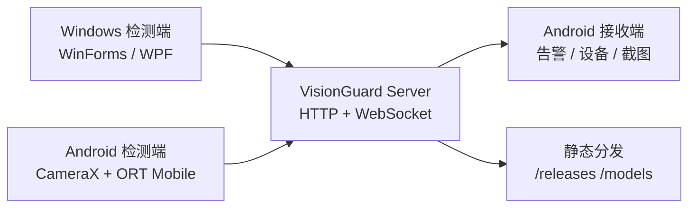

# VisionGuard

> Windows / Android 本地检测 + Node.js 中继 + Android 接收端告警的 AI 实时监控系统。

[](./VERSION)
[](./LICENSE)
[](./docs/codex/00-index.md)

[快速上手](#快速上手) | [系统链路](#系统链路) | [构建与验证](#构建与验证) | [文档入口](#文档入口)

VisionGuard 把本地视频/屏幕推理、隐私遮罩、WebSocket 告警中继、截图传输、模型按需下载和客户端更新分发放在同一个工程里。当前权威版本源是根目录 [`VERSION`](./VERSION)，正式服务域名是 `https://visionguard.xgwnje.cn`。

## 当前状态

| 项 | 当前值 | 来源 |
|---|---:|---|
| 当前版本 | `4.2.1` | [`VERSION`](./VERSION) |
| Server 运行时 | Node.js 20+ | [`server/package.json`](./server/package.json) |
| 发行包 | 不内置 ONNX 模型 | [`server/data/releases.json`](./server/data/releases.json) |
| 事实文档 | `docs/codex/` | [`docs/codex/00-index.md`](./docs/codex/00-index.md) |

## 系统链路



检测端统一推理链：

```text
Capture -> MaskApply -> Preprocess -> ONNX Inference -> Parse -> AlertDecision -> Push
```

遮罩使用归一化坐标 `[0,1]`，在推理前生效，因此会同时影响识别结果和报警截图。监控运行中修改遮罩会在下一个 Tick 生效。

## 快速上手

### 先读这些

- [docs/codex/00-index.md](./docs/codex/00-index.md)：当前解释性文档总入口
- [docs/codex/90-verification-report.md](./docs/codex/90-verification-report.md)：已验真的源码事实
- [AGENTS.md](./AGENTS.md)：Agent 协作、发布边界、危险操作和敏感配置规则

### Server 本地验证

```powershell
cd server
npm ci
npm test
npm run build
```

Server 必须提供 `API_KEY`。真实值放在 `server/.env` 或部署环境变量中，不要提交。

### 客户端入口

| 端 | 入口 | 说明 |
|---|---|---|
| Windows WinForms | `detector/windows-winforms/VisionGuard.slnx` | 主力检测端，.NET Framework 4.7.2，Win7+ |
| Windows WPF | `detector/windows-wpf/VisionGuard.sln` | 视觉升级线，.NET 9，Win10+ |
| Android 检测端 | `detector/android/` | CameraX + ONNX Runtime Mobile |
| Android 接收端 | `receiver/android/` | Compose + OkHttp + 前台服务 |

Android 两端从 Gradle 注入 `BuildConfig.API_KEY`。本地可在各自 `local.properties` 写 `VISIONGUARD_API_KEY=...`，也可通过 Gradle property 或环境变量提供。

## 项目结构

```text
detector/windows-winforms/   C# / .NET Framework 4.7.2 / WinForms
detector/windows-wpf/        C# / .NET 9 / WPF / MVVM
detector/android/            Kotlin / CameraX / ONNX Runtime Mobile
server/                      Node.js 20+ / TypeScript / Express / ws
receiver/android/            Kotlin / Jetpack Compose / OkHttp
docs/codex/                  已验真的项目说明、构建、发布和验证文档
docs/design/                 设计稿与视觉素材入口
```

## 关键能力

| 能力 | 当前实现 |
|---|---|
| 本地检测 | Windows 屏幕/窗口捕获，Android CameraX 图像分析 |
| 模型推理 | WinForms 使用 YOLOv5，WPF / Android 使用 YOLO26 |
| 隐私遮罩 | 三端使用相对坐标，推理前涂黑，截图同步遮挡 |
| 中继服务 | HTTP + WebSocket，角色为 `windows` / `android` / `android-detector` |
| 告警与截图 | Server 持久化告警，截图访问要求 `X-API-Key` |
| 自动更新 | `/api/update` 查询，`/releases/*` 静态下载 |
| 模型分发 | `/models/*` 按需下载，本地缓存复用 |

## 服务接口

| 用途 | 地址 |
|---|---|
| 正式服务 | `https://visionguard.xgwnje.cn` |
| WebSocket | `wss://visionguard.xgwnje.cn/ws` |
| 健康检查 | `https://visionguard.xgwnje.cn/health` |
| 更新查询 | `https://visionguard.xgwnje.cn/api/update` |
| 更新文件 | `https://visionguard.xgwnje.cn/releases/*` |
| 模型下载 | `https://visionguard.xgwnje.cn/models/*` |

线上部署、VPS、Nginx SNI 和公共 DNS 细节由独立的 Server-infra 文档维护；本仓库 README 只保留客户端和项目入口。

## 发行与模型

v4.2.1 发行包不包含 ONNX 模型，首次启动或切换模型时由客户端从 Server 下载并缓存。

| 端 | 发行包体积 | 模型缓存 |
|---|---:|---|
| WinForms | 2.4 MB | `%APPDATA%\VisionGuard\models\` |
| WPF | 4.7 MB | `%APPDATA%\VisionGuard\models\` |
| Android 检测端 | 39.6 MB | `filesDir/models/` |
| Android 接收端 | 20.9 MB | 不执行模型推理 |

模型文件不进入 Git，也不放进客户端发行包。发布流程会把模型收集到 `server/data/models/`，由 `/models/{modelKey}.onnx` 分发。

## 构建与验证

| 任务 | 入口 |
|---|---|
| Server 测试 | `cd server && npm test` |
| Server 编译 | `cd server && npm run build` |
| 五端编译 | `visionguard-build` skill |
| 端到端 / 设备 Smoke | `visionguard-e2e` skill |
| 版本对齐 | `version-alignment` skill |
| 客户端更新发布 | `push-update` skill |

发布和版本变更必须显式触发。不要在普通修复、编译或文档整理时自动修改 `VERSION`，也不要隐式运行 `scripts/sync-version.js`、`scripts/release.js` 或 `scripts/bump-version.sh`。

## 文档入口

| 文档 | 内容 |
|---|---|
| [docs/codex/10-project-overview.md](./docs/codex/10-project-overview.md) | 项目全局地图、统一概念、跨端约束 |
| [docs/codex/20-server.md](./docs/codex/20-server.md) | Server 职责、接口、环境变量、告警/截图/更新 |
| [docs/codex/30-windows-detector.md](./docs/codex/30-windows-detector.md) | WinForms / WPF 检测端差异 |
| [docs/codex/35-model-assets.md](./docs/codex/35-model-assets.md) | ONNX 模型、COCO 类别、目标子集 |
| [docs/codex/40-android-detector.md](./docs/codex/40-android-detector.md) | Android 检测端 |
| [docs/codex/50-android-receiver.md](./docs/codex/50-android-receiver.md) | Android 接收端 |
| [docs/codex/60-operations.md](./docs/codex/60-operations.md) | 构建、验证、发布、版本边界 |
| [docs/codex/90-verification-report.md](./docs/codex/90-verification-report.md) | 已验真事实与谨慎表述点 |
| [docs/design/README.md](./docs/design/README.md) | 设计稿与视觉素材入口 |

## 安全边界

- `server/.env`、Android `local.properties`、Android keystore 配置和截图缓存都属于本地/运行时数据，不应提交。
- `API_KEY` 不能为空；Server 为空时应拒绝启动。
- Server 截图路径是 `server/data/screenshots/<alertId>.(png|jpg)`，HTTP 下载需要 `X-API-Key`。
- Android 检测端前台服务类型是 `camera`，接收端是 `remoteMessaging`，不要混用。
- 构建输出不干净时，从 `.csproj` / Gradle 根源修复，不要只在发布脚本里事后删除。

## 许可证

MIT License，见 [LICENSE](./LICENSE)。
