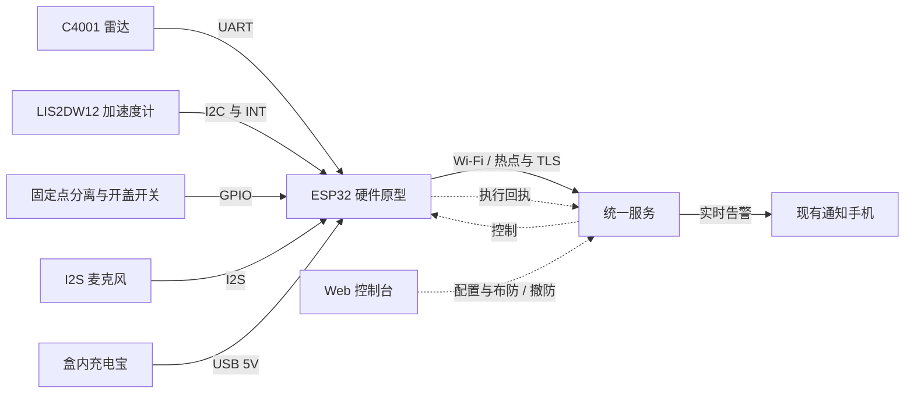

# 硬件原型设计与采购

负责：室外硬件原型的设计草案、采购清单、预算与选型条件。不负责：已交付功能、任务进度或验证证据。更新时机：owner 确认需求、器件或预算变化时。

## 目标与范围

目标：室外固定监测 2–8 米内人或骑行者经过，同时具备防拿走与突发大声 / 撞击告警，预算不超过 500 元，复用现有 Wi-Fi / 手机热点、服务器和通知手机。首轮采用雷达＋三轴加速度计＋固定点分离开关＋数字麦克风，共用 ESP32 与成品充电宝；先测各路覆盖、误漏报和耗电，再确定长期使用组合。这里只规划采购；硬件驱动与实际接入尚未实施。

## 采购清单

2026-10-09 核对的官方标价与配件预算如下；配件金额是采购预留，不是商家报价，运费与代焊从余量支付，已有物品直接复用。

| 物品 | 数量 | 型号或下单条件 | 金额（元） |
|---|---|---|---|
| 主雷达 | 1 | [DFRobot C4001，SEN0609，25m、UART 版](https://www.dfrobot.com.cn/goods-3851.html)；要求 5Pin 排针预焊或代焊，不混买 12m / I2C 版 | 官方标价 99 |
| Wi-Fi 开发板 | 1 | [FireBeetle 2 ESP32-E，DFR0654-F，预焊排母版](https://www.dfrobot.com.cn/goods-3048.html)；用于读雷达与联网，不承担视觉推理 | 官方标价 70 |
| 搬动 / 倾斜传感器 | 1 | [Fermion LIS2DW12 三轴加速度计，SEN0405，Breakout 版](https://mall.dfrobot.com.cn/goods-3186.html)；要求预焊 / 代焊，刚性固定在整机上；引出 I2C 和 INT 中断脚 | 官方标价 26 |
| 固定点分离 / 开盖开关 | 2 | 低压干接点防拆开关，各用于安装点分离和开盖；按结构接成“安装完好时闭合，拆下 / 开盖 / 断线时断开”，触发基准留在固定物上；确认微小电流可靠及户外密封 | 合计预留 10–20 |
| 数字麦克风 | 1 | [I2S 麦克风模块，SEN0327](https://www.dfrobot.com.cn/goods-2567.html)；3.3V 供电，要求预焊 / 代焊；读取声音幅度、峰值与背景变化 | 官方标价 15 |
| 麦克风防风 / 防水材料 | 1 套 | 防风海绵与声学透声防水膜，配向下的拾音口；按装机后的衰减重新测阈值 | 预留 5–10 |
| 成品电池电源 | 1 | 10000mAh 充电宝，5V / 2A USB 输出；确认能维持本原型的持续负载，不能依赖会定时退出的低电流模式；电源与控制板放在同一防拆盒内 | 预留 60–90 |
| USB 功率计 | 1 | 与充电宝输出口匹配，支持电压 / 电流及 Wh 累计；用于实测整机平均功率和可用能量 | 预留 25–35 |
| 塑料防水盒及密封件 | 1 套 | 标称 IP65 ABS 盒，非金属雷达前壁；内尺寸约 160×110×70mm 起，按实购充电宝核对；含出线密封件与遮阳挡雨件 | 预留 30–45 |
| 接线与下载材料 | 1 套 | 2.54mm 杜邦线、紧固端子 / 固定底板、热缩管、USB-A 转 USB-C 数据线；包含 I2C、I2S、开关回路及运动中断接线，室外装机后固定接头 | 预留 25–40 |
| 安装材料 | 1 套 | 可调角度支架、抱箍 / 扎带、绝缘柱与螺丝；雷达、加速度计和盒体固定，防拆触发件连接独立固定点，整机连支架搬走仍能触发分离 | 预留 15–25 |
| 合计 | | 不含已有电脑、热点手机、服务器及通知手机 | **380–475** |

保留 25–120 元机动费用；下单含运费、代焊与工具总额不得超过 500 元。万用表及充电宝优先复用；没有工具时选择配件预算下沿并核对代焊费用。第一轮暂不买屏幕、蜂鸣器、摄像头、4G、太阳能、裸电芯或定制 PCB；通知复用现有手机。

## 原型设计

规划接线与上报关系如下，硬件固件和对应控制台配置入口仍待开发：

ESP32 统一采集与判断三路信号，按现有传感器事件契约上报；服务负责账号权限、转发与中断监测，通知手机负责接警。雷达使用 UART、加速度计使用 I2C、麦克风使用 I2S，分别预留引脚，安装前核对 3.3V 供电 / 信号和共地。选用 SEN0405 Breakout 版以取得外部 INT 引脚，Gravity SEN0409 未引出该引脚，不能直接替代；依据见[官方加速度计资料](https://wiki.dfrobot.com.cn/_SKU_SEN0409_Gravity_I2C_LIS2DW12_Triple_Axis_Accelerometer)。

盒内固定电源、主板与加速度计；雷达正面留非金属窗口，麦克风使用向下的独立透声口，远离结构碰撞与风直接吹入的位置。分离开关的触发基准留在独立固定物上，开盖开关位于电源可被接触之前；移动整机时应能改变分离回路，不能把触发件也装在一起搬走的支架上。

## 告警行为

三路告警独立触发：经过检测、防拿走、异常声响均可单独上报，不要求雷达和麦克风同时命中。接入现有传感器节点、统一服务和控制台；布防 / 维护撤防及各路阈值须有控制台入口，并以节点执行回执确认实际结果。

- 防拿走：布防后用加速度变化与摆放姿态变化感知搬动 / 倾斜，用固定点分离开关感知轻缓移开，用开盖开关感知电源被接触。加速度计不能直接测位置，也不能证明盗窃；短暂晃动与持续搬动需现场区分。移动后重新静止不能自动解除已触发告警或学习新姿态，合法搬运先维护撤防、安装后再布防。断电 / 断网由现有服务中断监测兜底，只报告设备中断；Wi-Fi 已失联时无法保证即时送达“被拿走”事件。
- 异常声响：按 owner 确认先监测突发大声、撞击等明显变化，分别判断短促峰值与持续大声，并结合现场背景音调整阈值和冷却；风、雨、车辆及普通交谈分别测误报。首轮上报声音变化事件和强度指标，不保存或上传连续录音；不声称能识别玻璃破碎、争吵或声音来源，未校准幅度不标成实际环境分贝。麦克风开孔后的防水、防风、灵敏度与告警效果均待实测。

## 选型边界与到货验证

- [官方雷达资料](https://wiki.dfrobot.com.cn/sku_sen0609_c4001_mmwave_presence_sensor_25m)给出的测距范围为 1.2–25 米、测速范围为 0.1–10m/s（约 0.36–36km/h），支持调整距离、灵敏度与触发延迟。这是器件标称能力，不是室外慢走 / 骑行检出率；存在与测速属于不同工作模式，现场分别比较，不照抄例程的 1 秒触发延迟。
- 下单定位是经过检测试验件，不能据此承诺只识别人或骑行者；单雷达缺少已验证的人 / 车 / 动物分类。风吹草木、车辆、雨水与安装晃动需单独测误报；2 / 4 / 6 / 8 米分别覆盖慢走、靠近 / 远离、横向经过和骑行。横向测速可能低估真实速度，不能把测速值直接当骑行速度；不以长延迟或要求两个传感器同时触发掩盖漏报。
- [开发板资料](https://wiki.dfrobot.com/dfr0654/)确认支持 2.4GHz Wi-Fi、USB 5V 供电及 3.3V 电源输出；热点启用 2.4GHz。雷达优先按厂家支持的 3.3V 供电接入，装配时核对供电与 UART 电平；先用电脑 USB 验证，再切充电宝。联网及 TLS / WebSocket 固件仍需开发，购买器件不表示已能登录现有服务。
- 防拿走分别测试轻缓平移、抬起 / 倾斜、连支架移走、开盖、触发线断开和合法维护；风吹晃动及轻微碰撞单独测误报。声响分别测试短促撞击、持续大声及风雨 / 车辆 / 交谈背景，确认麦克风防护后仍能感知；断网、断电分别观察服务中断事件与通知收件，不假定即时送达。
- 原型先放在遮雨遮阳处，装机开孔后重新检查密封，盒子等级不等于整机防护认证。保留塑料雷达窗口并检查积水 / 水膜影响；若树木误报或骑行漏报无法通过朝向和距离配置控制，停在检测选型，不先堆电池或制作外壳定型。
- 连续监测时保持雷达工作，先测整机平均功率与告警期间峰值；不拿 ESP32 深睡电流推算联网运行续航。续航按实测充电宝可用 Wh ÷ 整机平均 W 计算，尚未承诺运行天数；接入后分别记录节点上报、服务转发和通知收件，不能用连接成功代替送达。
